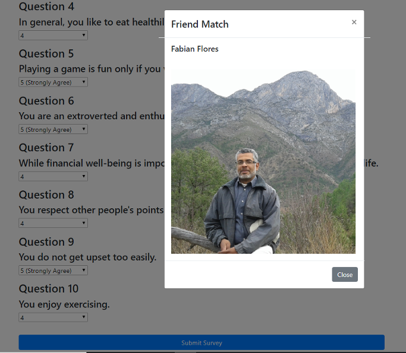

# friend-finder

Friend finder is a full-stack app that searches for the most compatible friends.

## Description

This app records results from users' survey forms. Subsequently, a user's responses are compared against those of other users. Friend finder will then search for the best overall match and return his or her name and photograph.

## Technical Information

I used a node web server for this project. The npm express package handles routing. And I leveraged Express "handlebars" for templating.

At first, the user is sent to the landing page. There is an option to "Go to Survey", and a website wide footer which includes links to the friend app api and the github repo for this project.

The app makes use of input validation so a user can fill out the form correctly.

Once a user successfully fills out the form, the friend finder app returns the user's best match, based on the least difference between the user and the rest of the app's members.

## Installation

This app can be cloned using git.

1. Now we are ready to clone this app by running the following command. `git clone git@github.com:f-flores/friend-finder.git`

2. Since this file makes use of a couple of node modules, please run `npm install`.  This installs all of the dependencies.

3. `friend-finder` is a full stack app that uses nodejs and express on the back end. It needs to be deployed to on a platform that provides (like Heroku) "back-end" support. [Guide to deploying a Node Web Server on Heroku](https://github.com/RutgersCodingBootcamp/RUTSOM201801FSF4-Class-Repository-FSF/blob/master/13-express/Supplemental/HerokuGuide.md)

## Comments

The source code for the bamazon app was added to my github page:
[friend-finder](https://github.com/f-flores/friend-finder)

A link to the friend-finder app:
[friend-finder app](https://morning-brushlands-77006.herokuapp.com/)